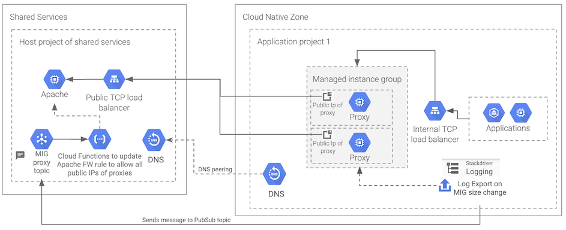

# Shared Services architecture

## Overview

The code in this repository implements a shared the service architecture depicted in the following diagram:



The system is composed of a **Shared Services** project that exposes a set of services to one or more applications called **Cloud Native Zones** (CNZ). The applications hosted in the CNZ projects will typically not have direct access to the internet. They will reach the shared services via an outgoing proxy that will be provided to them. The proxy will be able to autoscale, adding new instances to meet the demand from the CNZ applications.

On the other side, the Shared Services will expose the services via TCP or HTTP load balancers. These LBs will only accept incoming connections from the external IP addresses of the CNZ proxy instances. Since the number of proxy instances may vary depending on the CNZ load, the firewall rules need to be updated to refresh the list of external IP addresses of the proxies. This dynamic IP address filtering is implemented by a Cloud Function that refreshes the incoming firewall rules whenever a proxy instance is added or removed.

## Implementation

You will find here two different terraform implemantations of the architecture described above:

1. A [flat implementation](./terraform_flat) that does not use any terraform modules and relies only on the terraform resources from the [Google Cloud Platform Provider](https://www.terraform.io/docs/providers/google/index.html). This flat and verbose approach will allow us to explain each one of the architectire components in a series of Medium articles.
2. A [CFT based implementation](./terraform_cft), that relies on the [Cloud Foundation Toolkit modules](https://github.com/GoogleCloudPlatform/cloud-foundation-toolkit). This implementation is much more compact and streamlined, and serves as a real world example of how you can leverage CFT modules to simplify your GCP infrastructure deployments.

## Resources

The following resources will be created in the shared services project:
```(bash)
# VPC network
google_compute_network.svc_network
google_compute_subnetwork.service

# Reserved IP addresses for the sample service and the health check service
google_compute_address.healthz
google_compute_address.tcp_lb_example

# Configuration to allow ssh connections to the instances via the IAP
google_compute_firewall.allow_ssh_from_iap_to_all
google_iap_tunnel_instance_iam_policy.healthz
google_service_account_iam_member.tunnel_user[0]

# VM instances for the sample service and the health check service
google_compute_instance.healthz
google_compute_instance.sample_service

# TCP load balancer for the sample service
google_compute_forwarding_rule.tcp_lb_example
google_compute_target_pool.shared_service

# DNS private zone and records for the sample service and health service
google_dns_managed_zone.services
google_dns_record_set.outbound_proxy
google_dns_record_set.service_catalog[0]
google_dns_record_set.service_catalog[1]

# The cloud function that update sthe firewall rules
google_cloudfunctions_function.fw_updater
google_storage_bucket.cloud_function
google_storage_bucket_object.cloud_function

# Custom role and permissions for the Cloud Function service account
google_project_iam_custom_role.fw_rule_updater
google_project_iam_member.fw_rule_updater

# PubSub topic where autoscale notifications will be received
google_pubsub_topic.proxy_updates
google_pubsub_topic_iam_member.proxy_notifiers[0]

# Service accounts for the Cloud Function and the shared services
google_service_account.fw_updater_cf
google_service_account.shared_service
```

The following resources will be created in the Cloud Native Zone project:

```(bash)
# VPC network
google_compute_network.cnz_network
google_compute_subnetwork.service
google_compute_subnetwork.application

# Reserved IP addresses for the ILB in front of the outgoing proxy
google_compute_address.outbound_proxy

# Configuration to allow ssh connections to the instances via the IAP
google_compute_firewall.allow_ssh_from_iap_to_all
google_iap_tunnel_instance_iam_policy.client_app
google_service_account_iam_member.tunnel_user[0]

# Allowed communications through proxy
google_compute_firewall.allow_from_all_to_proxy
google_compute_firewall.allow_from_squid_proxy_to_shared_services

# VM instance for the test application
google_compute_instance.client_app

# Instance group for the outbound proxy
google_compute_instance_group_manager.outbound_proxy
google_compute_instance_template.outbound_proxy
google_compute_autoscaler.outbound_proxy
google_project_iam_member.proxy_log_writer

# Internal Load Balancer for the outbound proxy
google_compute_forwarding_rule.outbound_proxy
google_compute_health_check.outbound_proxy
google_compute_region_backend_service.outbound_proxy

# DNS private zone managed (peered) from the shared services project
google_dns_managed_zone.services

# Log sink that sends autoscaling notifs to the shared services PubSub
google_logging_project_sink.autoscaler

# Custom role and permissions for the Cloud Function service account
google_project_iam_custom_role.fw_rule_updater
google_project_iam_member.fw_rule_updater

# Service accounts for the proxy instances and the test application instance
google_service_account.application_sa
google_service_account.squid_proxy
```

